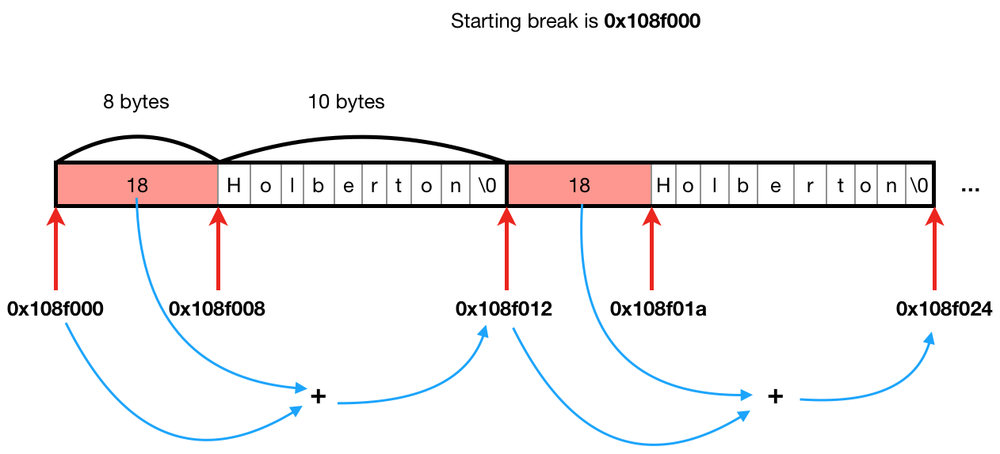

<h1 align="center">C - malloc</h1>

## [EYNTK] Writing your own dynamic allocation library

### Everything you need to know to implement your own dynamic allocation library

Before we start, make sure to:

* **Read really carefully** [Julien’s blog post](https://blog.holbertonschool.com/hack-the-virtual-memory-malloc-the-heap-the-program-break/)
* Read carefully the manual page of [sbrk(2)](https://www.man7.org/linux/man-pages/man2/sbrk.2.html)
* Read carefully the manual page of [malloc(3)](https://man7.org/linux/man-pages/man3/malloc.3.html)

In this concept, I’m going to build with you a simple implementation of `malloc`. It is advised to implement and test the examples throughout this concept in order to truly get the most out of this tutorial, and be prepared for the `malloc` project.

**Environment used:**

* Linux 3.13.0-92-generic
* Ubuntu Server 14.04 LTS
* gcc (Ubuntu 4.8.4-2ubuntu1~14.04.3) 4.8.4
* GNU libc 2.19

**IMPORTANT NOTE:** We’re going to describe the glibc `malloc` function and try to analyze how it works, in order to develop our own implementation of this function. The glibc `malloc` function is really well designed , so we won’t waste time explaining every intricacy. I invite you to test it on your own, in order to see how it is designed, and how it manages memory chunks. Don’t jump on trying to reproduce `malloc` with its exact same behavior. Focus on something that works first.

**Starting break**
Let’s dive directly into things by writing a simple program that prints out the address of the starting program break, using [sbrk(2)](https://www.man7.org/linux/man-pages/man2/sbrk.2.html)

```
alex@~/0x08-malloc/concept$ cat 0-main.c
#include <stdlib.h>
#include <stdio.h>
#include <unistd.h>

/**
 * main - Program entry point
 *
 * Return: EXIT_SUCCESS or EXIT_FAILURE
 */
int main(void)
{
    void *ptr;

    ptr = sbrk(0);
    printf("Starting break is %p\n", ptr);

    return (EXIT_SUCCESS);
}
alex@~/0x08-malloc/concept$ gcc -Wall -Wextra -Werror -pedantic 0-main.c 
alex@~/0x08-malloc/concept$ ./a.out 
Starting break is 0x12f2000
alex@~/0x08-malloc/concept$ ./a.out 
Starting break is 0x8fc000
alex@~/0x08-malloc/concept$ ./a.out 
Starting break is 0x2420000
alex@~/0x08-malloc/concept$ ./a.out 
Starting break is 0x18d2000
alex@~/0x08-malloc/concept$ ./a.out 
Starting break is 0x1b9f000
alex@~/0x08-malloc/concept$
```

If you’re wondering why the starting break in your executable is never the same, it means you didn’t read carefully [Julien’s blog post](https://blog.holbertonschool.com/hack-the-virtual-memory-malloc-the-heap-the-program-break/). Also see [ASLR](https://en.wikipedia.org/wiki/Address_space_layout_randomization).

### Segfault

Now you should know that `sbrk(0);` gives you the address of the program break. If you try to access the information at this address, guess what …

**Segmentation fault (core dumped)**

Yes, it’s not that simple. We cannot read from unallocated memory, as well as we cannot write in unallocated memory.

In order to be able to do so, we will need to write a simple program that extends the program break by `1 byte`, in order to store the char `H` in it. Try to print the address of the program break before extending it. After extending the address, print the char you stored there. :)

```
alex@~/0x08-malloc/concept$ gcc -Wall -Wextra -Werror -pedantic 1-main.c 
alex@~/0x08-malloc/concept$ ./a.out 
Starting break is 0x2030000
Break after extension is 0x2030001
Address of our char is 0x2030000
Value at this address is 'H'
alex@~/0x08-malloc/concept$ 
```

### Our own malloc

Now that you are able to extend the program break and allocate memory, try to write a naive version of `malloc` that simply extends the program break by the size it is given, only by using `sbrk`

```
alex@~/0x08-malloc/concept$ cat 2-main.c
#include <stdlib.h>
#include <stdio.h>
#include <string.h>
#include <unistd.h>

void *naive_malloc(size_t size);

/**
 * main - Program entry point
 *
 * Return: EXIT_SUCCESS or EXIT_FAILURE
 */
int main(void)
{
    char *str;
    int i;

    printf("Starting break is %p\n", sbrk(0));

    for (i = 0; i < 10; i++)
    {
        str = naive_malloc(10);
        strcpy(str, "Holberton");
        str[9] = '\0';
        printf("%p: %s\n", (void *)str, str);
    }

    printf("Final break is %p\n", sbrk(0));
    return (EXIT_SUCCESS);
}
alex@~/0x08-malloc/concept$ gcc -Wall -Wextra -Werror -pedantic 2-main.c 2-naive_malloc.c
alex@~/0x08-malloc/concept$ ./a.out 
Starting break is 0x7df000
0x7df000: Holberton
0x7df00a: Holberton
0x7df014: Holberton
0x7df01e: Holberton
0x7df028: Holberton
0x7df032: Holberton
0x7df03c: Holberton
0x7df046: Holberton
0x7df050: Holberton
0x7df05a: Holberton
Final break is 0x7df064
alex@~/0x08-malloc/concept$ ./a.out 
Starting break is 0xdea000
0xdea000: Holberton
0xdea00a: Holberton
0xdea014: Holberton
0xdea01e: Holberton
0xdea028: Holberton
0xdea032: Holberton
0xdea03c: Holberton
0xdea046: Holberton
0xdea050: Holberton
0xdea05a: Holberton
Final break is 0xdea064
alex@~/0x08-malloc/concept$ 
```

Following is the content of our heap after the initial program break:

As we can see, beside the fact that we are not able to manage our memory chunks, and thus free/realloc anything, our `naive_malloc` is fully optimized, no extra byte is allocated and everything is contiguous and packed in memory! \o/

Wait a minute, is it really optimized?

### Improvements

Actually, there are some improvements that can be done.

Let’s run the same example as above, but this time, using `malloc(3)`:

```
alex@~/0x08-malloc/concept$ cat 2-main_malloc.c 
#include <stdlib.h>
#include <stdio.h>
#include <string.h>
#include <unistd.h>

/**
 * main - Program entry point
 *
 * Return: EXIT_SUCCESS or EXIT_FAILURE
 */
int main(void)
{
    char *str;
    int i;

    printf("Starting break is %p\n", sbrk(0));

    for (i = 0; i < 10; i++)
    {
        str = malloc(10);
        strcpy(str, "Holberton");
        str[9] = '\0';
        printf("%p: %s, ", (void *)str, str);
        printf("program break: %p\n", sbrk(0));

    }

    printf("Final break is %p\n", sbrk(0));
    return (EXIT_SUCCESS);
}
alex@~/0x08-malloc/concept$ gcc -Wall -Wextra -Werror -pedantic 2-main_malloc.c 
alex@~/0x08-malloc/concept$ ./a.out 
Starting break is 0x1e84000
0x1e84010: Holberton, program break: 0x1ea5000
0x1e84030: Holberton, program break: 0x1ea5000
0x1e84050: Holberton, program break: 0x1ea5000
0x1e84070: Holberton, program break: 0x1ea5000
0x1e84090: Holberton, program break: 0x1ea5000
0x1e840b0: Holberton, program break: 0x1ea5000
0x1e840d0: Holberton, program break: 0x1ea5000
0x1e840f0: Holberton, program break: 0x1ea5000
0x1e84110: Holberton, program break: 0x1ea5000
0x1e84130: Holberton, program break: 0x1ea5000
Final break is 0x1ea5000
alex@~/0x08-malloc/concept$
```

Three things here:

* The first time we call malloc, the address returned is 16 bytes after the initial program break
* The program break is increased by a big value only when we call malloc the first time, but stays the same after the next calls
* It seems that `malloc` allocates more memory than we asked for

### 1. The memory chunk header

I hope that you read [Julien’s blog post](https://blog.holbertonschool.com/hack-the-virtual-memory-malloc-the-heap-the-program-break/), and that you know what those leading `16 bytes` are (See `The 0x10 lost bytes`), because I’m gonna assume you do. :)

Let’s write a new version of our naive malloc, that will allocate more space than asked in order to store a small header at the beginning of the allocated chunk. For now, we will only need to store the size of the memory chunk in a size_t. So we will need to extend the program break by `size + sizeof(size_t)`, and return the `address of the chunk + sizeof(size_t)` (the address returned by our malloc must be after our header).

```
alex@~/0x08-malloc/concept$ cat 3-main.c 
#include <stdlib.h>
#include <stdio.h>
#include <string.h>
#include <unistd.h>

void *naive_malloc_header(size_t size);

/**
 * main - Program entry point
 *
 * Return: EXIT_SUCCESS or EXIT_FAILURE
 */
int main(void)
{
    char *str;
    int i;

    printf("Starting break is %p\n", sbrk(0));

    for (i = 0; i < 10; i++)
    {
        void *chunk;

        str = naive_malloc_header(10);
        strcpy(str, "Holberton");
        str[9] = '\0';
        printf("%p: %s, ", (void *)str, str);
        chunk = (void *)(str - sizeof(size_t));
        printf("chunk starting at address %p, ", (void *)chunk);
        printf("chunk size is %lu\n", *((size_t *)chunk));
    }

    printf("Final break is %p\n", sbrk(0));
    return (EXIT_SUCCESS);
}
alex@~/0x08-malloc/concept$ gcc -Wall -Wextra -Werror -pedantic 3-main.c 3-naive_malloc_header.c
alex@~/0x08-malloc/concept$ ./a.out 
Starting break is 0x108f000
0x108f008: Holberton, chunk starting at address 0x108f000, chunk size is 18
0x108f01a: Holberton, chunk starting at address 0x108f012, chunk size is 18
0x108f02c: Holberton, chunk starting at address 0x108f024, chunk size is 18
0x108f03e: Holberton, chunk starting at address 0x108f036, chunk size is 18
0x108f050: Holberton, chunk starting at address 0x108f048, chunk size is 18
0x108f062: Holberton, chunk starting at address 0x108f05a, chunk size is 18
0x108f074: Holberton, chunk starting at address 0x108f06c, chunk size is 18
0x108f086: Holberton, chunk starting at address 0x108f07e, chunk size is 18
0x108f098: Holberton, chunk starting at address 0x108f090, chunk size is 18
0x108f0aa: Holberton, chunk starting at address 0x108f0a2, chunk size is 18
Final break is 0x108f0b4
alex@~/0x08-malloc/concept$ 
```


Ok that’s great, now we have a header in front of our chunk that will let us know its size \o/

But why? We were doing just fine without it, so why would we need to have a header that tells us the size of a chunk we already know since we called our `malloc` function specifying the size we wanted?

These are fair questions, and thank you for asking! For now, it may seems useless, but it’s actually critical to keep track of the chunks to free and realloc them. It will also be useful for the next improvement:

### 2. Memory pages

As described in Julien’s blog post (did you read it?), the first time we call it, `malloc` will increase the program break by a significant value to avoid calling `sbrk`, or `brk` every time we call it, and thus make the allocation faster on next calls.

But this value is not arbitrary, it is chosen by design. In fact, the glibc `malloc` will always extend the program break by a multiple of the virtual memory page size. On most 64-bit architectures, a page size will be `4kiB` (4096 bytes). In C, we can determine the virtual memory page size using [sysconf(3)](https://man7.org/linux/man-pages/man3/sysconf.3.html).

So the process is pretty straightforward: the first time we call `malloc`, it will extend the program break by a certain multiple of the virtual memory page size, and keep the excess memory for future allocations. When a memory page is full, `malloc` will extend the program break again.

Ok, so to improve our `malloc`, we just need to extend the break by the virtual memory page size, and we’re good?

Hmmm … it’s not that simple actually. We need to think about some complications.
Ok. The first time our malloc is called we extend the program break by the page size. However when we call it again we should not extend again, but instead use the excess memory of the first call. So how do we know if our function has been called before? Well, we need to keep track of our chunks to determine if we need to extend or not.

Yes, we’ll need to use a static variable in our function that will store the address of the beginning of the heap. So when our function is called the first time, we extend the break, and keep track of the address of the first chunk (which is located at the very beginning of the heap). Since our chunk header stores the size of the chunk, we will now be able to go from a chunk to the next one in our future calls !



The next thing is that we need to know where our chunks end. For example, after calling our malloc the first time, there should only be one single chunk followed by unused memory.


We need to put a chunk header as well at the beginning of this unused chunk, in order to keep track of it as well.


Here, `N` will be the size of the excess memory.

So now, every time we add a chunk in our chain, we’ll need to split the unused chunk to make room for the new used chunk :) (without forgetting to put a header to our unused chunk).

But wait, there’s still something missing here. How do we know a chunk is actually used or available to be returned to the user. Right now, our chunk header only tells us the size of each memory chunk, but this is not enough. We will need a flag to tells us whether a chunk is in use or free to be used.

For now, let’s just have another static variable in our malloc function that keeps track of the number of chunks allocated. (i.e after `X` calls to our malloc, this variable will hold the value `X`). It’ fine for now, since all our chunks will be contiguous, we know that the `X+1` th chunk will be free! (i.e if we call our malloc 4 times, we will then have 4 chunks allocated, so the 5th is free to use).

Alright ! I think we’re ready to improve our malloc :)
Let’s just do a quick recap of what needs to be done: - We need two static variables in our function: - One to keep track of the address of the first chunk in our chain (which is also the address of the beginning of the heap) - And another one to keep track of the number of chunks used in our chain (in other words, the number of times our function has been called) - The first time our malloc is called, we need to extend the program break by the virtual memory page size. - Each time our function is called, we need to go through our chain of chunks (using the size in the chunks’ header) in order to locate the unused chunk - We then need to split this unused chunk in two chunks, the first will be the one returned (the used one). The second one will be the excess memory (the unsed one) - We don’t want to re-extend the heap when it’s full for now, because we’ll do that later. Just extend it the first time our function is called.

**Quick tip:**  This step may be harder than you think, don’t hesitate to print a lot within your malloc in order to debug.

```
alex@~/0x08-malloc/concept$ cat 4-main.c 
#include <stdlib.h>
#include <stdio.h>
#include <string.h>
#include <unistd.h>

void *naive_malloc_page(size_t size);

/**
 * main - Program entry point
 *
 * Return: EXIT_SUCCESS or EXIT_FAILURE
 */
int main(void)
{
    char *str;
    int i;

    printf("Starting break is %p\n", sbrk(0));

    for (i = 0; i < 10; i++)
    {
        void *chunk;

        str = naive_malloc_page(10);
        strcpy(str, "Holberton");
        str[9] = '\0';
        printf("%p: %s, ", (void *)str, str);
        chunk = (void *)(str - sizeof(size_t));
        printf("chunk addr: %p, ", (void *)chunk);
        printf("size: %lu, ", *((size_t *)chunk));
        printf("break: %p\n", sbrk(0));
    }

    printf("Final break is %p\n", sbrk(0));
    return (EXIT_SUCCESS);
}
alex@~/0x08-malloc/concept$ gcc -Wall -Wextra -Werror -pedantic 4-main.c 4-naive_malloc_page.c 
alex@~/0x08-malloc/concept$ ./a.out 
Starting break is 0x1c3d000
0x1c3d008: Holberton, chunk addr: 0x1c3d000, size: 18, break: 0x1c3e000
0x1c3d01a: Holberton, chunk addr: 0x1c3d012, size: 18, break: 0x1c3e000
0x1c3d02c: Holberton, chunk addr: 0x1c3d024, size: 18, break: 0x1c3e000
0x1c3d03e: Holberton, chunk addr: 0x1c3d036, size: 18, break: 0x1c3e000
0x1c3d050: Holberton, chunk addr: 0x1c3d048, size: 18, break: 0x1c3e000
0x1c3d062: Holberton, chunk addr: 0x1c3d05a, size: 18, break: 0x1c3e000
0x1c3d074: Holberton, chunk addr: 0x1c3d06c, size: 18, break: 0x1c3e000
0x1c3d086: Holberton, chunk addr: 0x1c3d07e, size: 18, break: 0x1c3e000
0x1c3d098: Holberton, chunk addr: 0x1c3d090, size: 18, break: 0x1c3e000
0x1c3d0aa: Holberton, chunk addr: 0x1c3d0a2, size: 18, break: 0x1c3e000
Final break is 0x1c3e000
alex@~/0x08-malloc/concept$
```

Okay, take a deep breath, and let’s see what needs to be improved next:
Our malloc calls `sbrk` only once. But we want to be able to extend the program break when our heap is full.

Right now, if we want to allocate more than a page size, our function will segfault, trying to access memory beyond the program break:

```
alex@~/0x08-malloc/concept$ cat 4-main_beyond.c 
#include <stdlib.h>
#include <stdio.h>
#include <string.h>
#include <unistd.h>

void *naive_malloc_page(size_t size);

/**
 * main - Program entry point
 *
 * Return: EXIT_SUCCESS or EXIT_FAILURE
 */
int main(void)
{
    char *str;
    int i;

    printf("Starting break is %p\n", sbrk(0));

    for (i = 0; i < 10; i++)
    {
        void *chunk;

        str = naive_malloc_page(1016);
        strcpy(str, "Holberton");
        str[9] = '\0';
        printf("%p: %s, ", (void *)str, str);
        chunk = (void *)(str - sizeof(size_t));
        printf("chunk addr: %p, ", (void *)chunk);
        printf("size: %lu, ", *((size_t *)chunk));
        printf("break: %p\n", sbrk(0));
    }

    printf("Final break is %p\n", sbrk(0));
    return (EXIT_SUCCESS);
}
alex@~/0x08-malloc/concept$ gcc -Wall -Wextra -Werror -pedantic 4-main_beyond.c 4-naive_malloc_page.c 
alex@~/0x08-malloc/concept$ ./a.out 
Starting break is 0x1aa9000
0x1aa9008: Holberton, chunk addr: 0x1aa9000, size: 1024, break: 0x1aaa000
0x1aa9408: Holberton, chunk addr: 0x1aa9400, size: 1024, break: 0x1aaa000
0x1aa9808: Holberton, chunk addr: 0x1aa9800, size: 1024, break: 0x1aaa000
Segmentation fault (core dumped)
alex@~/0x08-malloc/concept$
```

Here, we try to allocate chunks of size `1024` (requested size is `1016` + `8` for the chunk header), but only 3 chunks are successfully allocated. Isn’t it strange since our page size is `4096` bytes? (at least on my 64-bit architecture it is)

Well, the thing is that when the first three chunks are allocated, the remaining space available is exactly `1024`, but when I’m asking for this exact size, my current version of `malloc` will try to split these `1024` bytes in two chunks: One of size `1024`, and the following of size `available - requested + header_size`, which is `1024 - 1024 + 8`. You got it, I’m trying to set a header for the next chunk following those 1024 remaining bytes, but no more memory is available -> Segfault

In order to allocate more space when a page is full, we (obviously) need to check if there is enough space in our last chunk to store both our new chunk AND at least the size of our chunk header. If not enough space is available, then it means we have to allocate a new page using `sbrk`. Ok, let’s do it !

```
alex@~/0x08-malloc/concept$ cat 5-main.c 
#include <stdlib.h>
#include <stdio.h>
#include <string.h>
#include <unistd.h>

void *naive_malloc_extend(size_t size);

/**
 * main - Program entry point
 *
 * Return: EXIT_SUCCESS or EXIT_FAILURE
 */
int main(void)
{
    char *str;
    int i;

    printf("Starting break is %p\n", sbrk(0));

    for (i = 0; i < 10; i++)
    {
        void *chunk;

        str = naive_malloc_extend(1016);
        strcpy(str, "Holberton");
        str[9] = '\0';
        printf("%p: %s, ", (void *)str, str);
        chunk = (void *)(str - sizeof(size_t));
        printf("chunk addr: %p, ", (void *)chunk);
        printf("size: %lu, ", *((size_t *)chunk));
        printf("break: %p\n", sbrk(0));
    }

    printf("Final break is %p\n", sbrk(0));
    return (EXIT_SUCCESS);
}
alex@~/0x08-malloc/concept$ gcc -Wall -Wextra -Werror -pedantic 5-main.c 5-naive_malloc_extend.c 
alex@~/0x08-malloc/concept$ ./a.out 
Starting break is 0x14fd000
0x14fd008: Holberton, chunk addr: 0x14fd000, size: 1024, break: 0x14fe000
0x14fd408: Holberton, chunk addr: 0x14fd400, size: 1024, break: 0x14fe000
0x14fd808: Holberton, chunk addr: 0x14fd800, size: 1024, break: 0x14fe000
0x14fdc08: Holberton, chunk addr: 0x14fdc00, size: 1024, break: 0x14ff000
0x14fe008: Holberton, chunk addr: 0x14fe000, size: 1024, break: 0x14ff000
0x14fe408: Holberton, chunk addr: 0x14fe400, size: 1024, break: 0x14ff000
0x14fe808: Holberton, chunk addr: 0x14fe800, size: 1024, break: 0x14ff000
0x14fec08: Holberton, chunk addr: 0x14fec00, size: 1024, break: 0x1500000
0x14ff008: Holberton, chunk addr: 0x14ff000, size: 1024, break: 0x1500000
0x14ff408: Holberton, chunk addr: 0x14ff400, size: 1024, break: 0x1500000
Final break is 0x1500000
alex@~/0x08-malloc/concept$ 
```

There we go, now when a page is full, another one is allocated :)

Well, that was a big piece right? And guess what, it’s not over yet \o/ !

### 3. Alignment
Now if you look back to the example using the real malloc, you may see that malloc actually allocates more memory than we asked:

When we ask `malloc` for 10 bytes, it actually allocates 32 bytes:

* `16 bytes` for the header
* `16 bytes` for us (it will return a pointer to these 16 bytes)

The reason for this is that malloc will always return an address that is `aligned`.

Read carefully this answer [about memory alignment](https://stackoverflow.com/questions/381244/purpose-of-memory-alignment/381368#381368).

Now that we know the purpose of memory alignment, the manual page of malloc(3) states that “The malloc() function returns a pointer to the allocated memory that is suitably aligned for any kind of variable”. What does it mean?

Well, it means that `malloc` will return an address that is aligned for ANY type. In other words, the returned address will be aligned for ALL types. And in order for this address to be aligned for any type, it must be aligned for the biggest type.

On a 64-bit architecture, the biggest type (a pointer in C) will be stored on 64 bits (8 bytes). Thus, the address returned by `malloc` on a 64-bit architecture will always be aligned on `8 bytes`.

The reason for that is that malloc is only given the number of bytes you want to be allocated, but it doesn’t know in what kind of variable you want to use these bytes (pointer, array, structure, …). The best option for `malloc` is to return an address that is aligned for any of them.

The implementation is pretty simple actually, the `size` that is given to us in our malloc function must be rounded up to the next multiple of `8`. The very first call to `sbrk` will return the address of the beginning of the heap. This address, although random (See [ASLR](https://en.wikipedia.org/wiki/Address_space_layout_randomization)), will always be `page-aligned`.

Here’s the trick ! We allocate extra space when the size is not a multiple of 8, so the next address after our chunk (the address of the next chunk) will be aligned on a multiple of 8 :)

Let’s do it ! [Here are some formulas](https://en.wikipedia.org/wiki/Data_structure_alignment#Computing_padding) you can use to perform address alignment.

```
alex@~/0x08-malloc/concept$ cat 6-main.c 
#include <stdlib.h>
#include <stdio.h>
#include <string.h>
#include <unistd.h>

void *naive_malloc_align(size_t size);

/**
 * main - Program entry point
 *
 * Return: EXIT_SUCCESS or EXIT_FAILURE
 */
int main(void)
{
    char *str;
    int i;

    printf("Starting break is %p\n", sbrk(0));

    for (i = 0; i < 10; i++)
    {
        void *chunk;

        str = naive_malloc_align(10);
        strcpy(str, "Holberton");
        str[9] = '\0';
        printf("%p: %s, ", (void *)str, str);
        chunk = (void *)(str - sizeof(size_t));
        printf("chunk addr: %p, ", (void *)chunk);
        printf("size: %lu, ", *((size_t *)chunk));
        printf("break: %p\n", sbrk(0));
    }

    printf("Final break is %p\n", sbrk(0));
    return (EXIT_SUCCESS);
}
alex@~/0x08-malloc/concept$ gcc -Wall -Wextra -Werror -pedantic 6-main.c 6-naive_malloc_align.c 
alex@~/0x08-malloc/concept$ ./a.out 
Starting break is 0x1924000
0x1924008: Holberton, chunk addr: 0x1924000, size: 24, break: 0x1925000
0x1924020: Holberton, chunk addr: 0x1924018, size: 24, break: 0x1925000
0x1924038: Holberton, chunk addr: 0x1924030, size: 24, break: 0x1925000
0x1924050: Holberton, chunk addr: 0x1924048, size: 24, break: 0x1925000
0x1924068: Holberton, chunk addr: 0x1924060, size: 24, break: 0x1925000
0x1924080: Holberton, chunk addr: 0x1924078, size: 24, break: 0x1925000
0x1924098: Holberton, chunk addr: 0x1924090, size: 24, break: 0x1925000
0x19240b0: Holberton, chunk addr: 0x19240a8, size: 24, break: 0x1925000
0x19240c8: Holberton, chunk addr: 0x19240c0, size: 24, break: 0x1925000
0x19240e0: Holberton, chunk addr: 0x19240d8, size: 24, break: 0x1925000
Final break is 0x1925000
alex@~/0x08-malloc/concept$
```

Here you can see that when asked for `10 bytes`, our malloc rounds up this value to the next multiple of 8, which is 16. Add to it the size of our header (a simple size_t, 8 bytes), and the size of the chunk becomes `24 bytes`. :)

### What’s next?
I gave you all you need to understand how to develop your own version of `malloc`. It is time for you to dive into it, and improve what we did to have something working.

Here are some improvements that can be done (amongst a lot):

* Find a way to remove the static counter we currently have, you don’t need this ugly thing :)
* When you’ll start to implement free, your malloc will have to evolve as well in order to analyze the chunk chain and look for an available chunk instead of putting every new chunk at the end of the chain.
* Our current header does not store enough information in order to have a well-optimized malloc. Try to find a good balance between what you need to store in your header, and the size of it (think memory alignment)
* Our current implementation of malloc doesn’t handle errors. What if there is no more memory available?

### Conclusion
**Good luck ! \o/**

Link to a [public GitHub repository](https://github.com/hs-hq/0x08-malloc_concept) containing all the examples used in this concept
